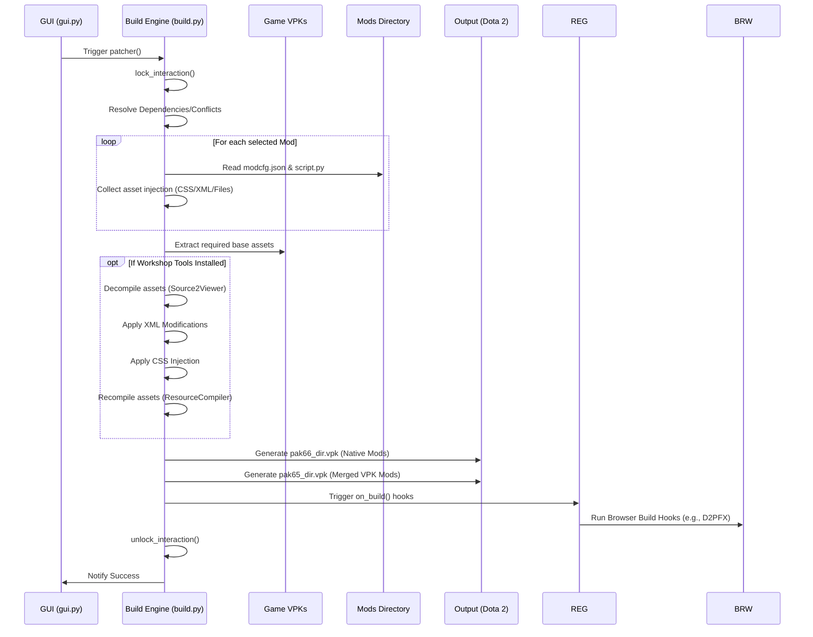
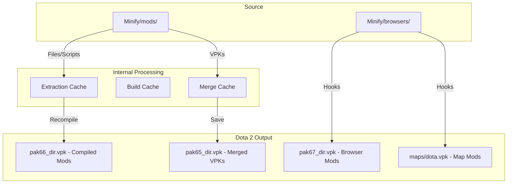

# Architecture of Dota2 Minify

This document provides a detailed overview of the system architecture, component relationships, and core workflows of `dota2-minify`.

## High-Level Overview

`dota2-minify` is built using a **Modular Hook-based Architecture**. The system is designed to be extensible, allowing for "native" mods (simple file/script additions) and "browser" mods (complex third-party integrations) to coexist within the same build pipeline.

### Core Philosophy

1. **Non-Destructive Patching**: Minify never modifies base game files (aside from some text and configuration files) directly. It creates side-loaded VPKs (`pak66_dir.vpk`, etc.) and instructs Steam to load them.
2. **Programmatic Modding**: Mods can contain Python scripts that run at various stages of the build process.
3. **UI-Driven Backend**: The DearPyGui interface directly triggers backend operations via a shared state and threading model.

---

## System Components

### 1. GUI Layer (DearPyGui)

The UI is managed primarily in `Minify/ui/`. It uses a functional approach for rendering and a shared state for managing interactions.

- **`gui.py`**: Manages the interaction lock (`interactive_lock`) to prevent UI operations during heavy I/O.
- **`terminal.py`**: A virtualized terminal that captures and displays build logs in real-time.
- **`checkboxes.py`**: Handles the state of mod selection and persistence (`mods.json`).
- **`settings.py`**: Dynamically generates UI components based on `modcfg.json` files found in mod directories.

### 2. Core Engine

Fundamental utilities used by both the UI and the Build pipeline.

- **`core/fs.py`**: Specialized file system operations (atomic moves, safe deletions, recursive creation).
- **`core/steam.py`**: Handles Steam library detection, game path resolution, and launch option patching.
- **`core/vpk_utils.py`**: High-level wrapper for `vpk` operations, including metadata generation (`minify_version.txt`).
- **`core/registry.py`**: A central registry for third-party browsers to hook into the system lifecycle.

### 3. Build Pipeline

The `Minify/build.py` module contains the "Patch" engine. It follows a strictly ordered pipeline.

---

## Workflows

### Patching Pipeline

The following diagram illustrates the lifecycle of a patch operation:

### Directory Relationship

The relationship between the source files and the final output:

---

## Modding Architecture

Mods are identified by the presence of a folder in `Minify/mods/`. The system scans these folders and interprets them based on their contents:

- **`modcfg.json`**: Metadata and UI configuration.
- **`notes.md`**: Localized descriptions shown in the details view.
- **`files/`**: Static assets copied directly into the output VPK.
- **`files_uncompiled/`**: Raw assets (XML/CSS) that require the `resourcecompiler`.
- **`script_*.py`**: Python hooks that run at specific stages (initial, after_patch, etc.).

### Hook Lifecycle

1. **`script_initial.py`**: Runs on app startup.
2. **`script.py`**: Runs during the collection phase of the patcher.
3. **`script_after_decompile.py`**: Runs after `Source2Viewer` has extracted and decompiled assets.
4. **`script_after_patch.py`**: Runs after the VPK has been saved and cleaned up.
5. **`script_uninstall.py`**: Runs when the user triggers uninstallation.

---

## Browser System

The Browser system (found in `Minify/browsers/`) allows for complex integrations.

- **Registration**: Browsers register themselves using `core.registry.register_browser(sys.modules[__name__])`.
- **UI Integration**: Browsers can add their own buttons to the main footer and open custom windows.
- **Build Hooks**: Browsers implement an `on_build(mod_list, current_mod)` function that is called at the end of the standard patching process, allowing them to perform specialized VPK merging or asset manipulation (as seen in `d2pfx/build_hook.py`).
