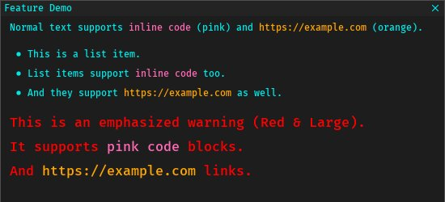
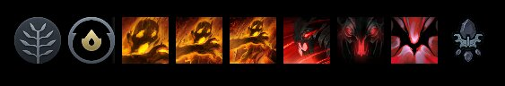

## Mod files and explanations

```plaintext
mods
├── <mod_name>
│   ├── files
│   │   ├── <path_to_file_in_pak>
│   │   ├── <...>
│   │   └── <...>
│   ├── files_uncompiled
│   │   ├── <path_to_file_in_pak>
│   │   ├── <...>
│   │   └── <...>
│   ├── manifest.json
│   ├── notes.md
│   ├── preview.jpg | preview.png
│   ├── blacklist.txt
│   ├── replacer.json
│   ├── script.py
│   ├── script_initial.py
│   ├── script_after_decompile.py
│   ├── script_after_recompile.py
│   ├── script_after_patch.py
│   ├── script_prelaunch.py
│   ├── script_uninstall.py
│   ├── script_utility.py
│   ├── styling.css
│   └── xml.json
```

### `manifest.json`

```json
{
  // defaults doesn't need to be indicated
  "always": false, // false by default, apply them without checking mods.json or checkbox
  "dependencies": ["<mod>"], // None by default, add a mod dependency's name here
  "conflicts": ["<mod>"], // None by default, add names of mutually exclusive mods here
  "order": 1, // default is 1, ordered from negative to positive to resolve any conflicts
  "visual": true, // true by default, show it in the UI as a checkbox
  "skip_workshop_check": false, // false by default, if true the mod won't be disabled when workshop tools are missing (use it for mods that can still function without workshop capabilities)
  "version": ">=1.13,<=1.14", // optional, enforces a Minify version requirement (supports operators: >=, <=, >, <, ==)

  // presets system for custom mod settings
  "presets": [
    {
      "name": "Example Preset",
      "values": {
        "example_inputbox": "preset_value",
        "example_checkbox": true
      }
    }
  ],

  // dynamically injects settings into the global Settings Menu
  "settings": [
    // key*: the internal name
    // type*: inputbox, checkbox, combo, number, slider, color
    // text: string that gets displayed on the left of the input. falls back to key if not given
    // default: the default value to reset back to and start with. falls back to falsy values
    {
      "key": "example_inputbox",
      "text": "Display Name",
      "force": false, // false by default, always show setting regardless of mod state
      "default": "example_value",
      "type": "inputbox"
    },
    {
      "key": "example_checkbox",
      "text": "Enable Feature",
      "force": false,
      "default": false,
      "type": "checkbox"
    },
    {
      "key": "example_combo",
      "text": "Select Option",
      "force": false,
      "default": "Value 1",
      "type": "combo",
      "items": ["Value 1", "Value 2"]
    },
    {
      "key": "example_number",
      "text": "Number",
      "force": false,
      "default": 10,
      "type": "number",
      "var_type": "int", // or "float"
      "step": 1 // default is 1 for ints, 0.1 for floats
    },
    {
      "key": "example_slider",
      "text": "Slider",
      "force": false,
      "default": 50,
      "type": "slider",
      "min": 0,
      "max": 100,
      "var_type": "int", // or "float"
      "step": 5 // default is 1 for ints, 0.1 for floats
    },
    {
      "key": "example_color",
      "text": "Color",
      "force": false,
      "default": "#ff0000ff",
      "type": "color"
    },
    {
      "key": "example_list",
      "text": "List",
      "force": false,
      "default": ["Item 1", "Item 2"],
      "type": "list"
    },
    {
      "key": "example_function", // binds the function named "example_function" from script_utility.py
      "text": "Function",
      "force": false,
      "type": "button"
    }
  ]
}
```

### `files`|`files_uncompiled` directory

`files` directory will drop the files put here into the pak that minify is going to create. These files should already be compiled.

`files_uncompiled` will drop the files onto the input folder **if the workshop tools are available**.

If not specifically protected by Dota2, these files will override any game content. This also applies for the rest of the modification methods available.

### `notes.md`

Displays information about a mod on `Details` window.

An image is rendered at the top if the file `preview.jpg` (or `preview.png`) exists.

```markdown
<!-- LANG:EN -->

Normal text supports `inline code` (pink) and https://example.com (orange).

- This is a list item.
- List items support `inline code` too.
- And they support https://example.com as well.

!!: This is an emphasized warning (Red & Large).
!!: It supports `pink code` blocks.
!!: And https://example.com links.
```



### `blacklist.txt`

This file is a list of path to files used to override those with blanks.
Supported file types can be found in [`bin/blank-files`](https://github.com/Egezenn/dota2-minify/tree/main/Minify/bin/blank-files).

A list of all the files (from the game pak) can be found in `bin/gamepakcontents.txt` of your installation.

| Modifier | Value               | Purpose                          |
| -------- | ------------------- | -------------------------------- |
|          | `path/to/file`      | Blacklisting a single file       |
| `>>`     | `path/to/directory` | Blacklisting an entire directory |
| `--`     | `path/to/file`      | Exclusion                        |
| `**`     | RegExp pattern      | Blacklisting patterns            |
| `*-`     | RegExp pattern      | Excluding patterns               |
| `#`      | Comment             |                                  |

After that with no blank spaces you put the path to the file you want to override.
`path/to/file`

```plaintext
particles/base_attacks/ranged_goodguy_launch.vpcf_c
>>particles/sprays
**taunt.*\.vsnd_c
```

### `replacer.json`

This file allows you to replace file(s) with other file(s) inside the game VPK (can be used for skin swappers etc.).

Format:  
`{"target_path": "replacement_path"}`

Example:

```json
{
  "panorama/images/spellicons/nevermore_shadowraze1_png.vtex_c": "panorama/images/spellicons/nevermore_shadowraze1_demon_png.vtex_c",
  "panorama/images/spellicons/nevermore_shadowraze2_png.vtex_c": "panorama/images/spellicons/nevermore_shadowraze2_demon_png.vtex_c",
  "panorama/images/spellicons/nevermore_shadowraze3_png.vtex_c": "panorama/images/spellicons/nevermore_shadowraze3_demon_png.vtex_c"
}
```


