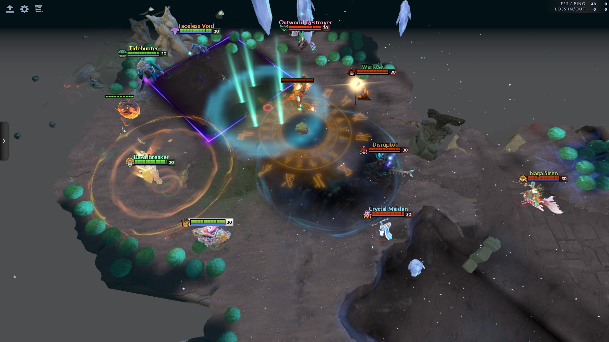
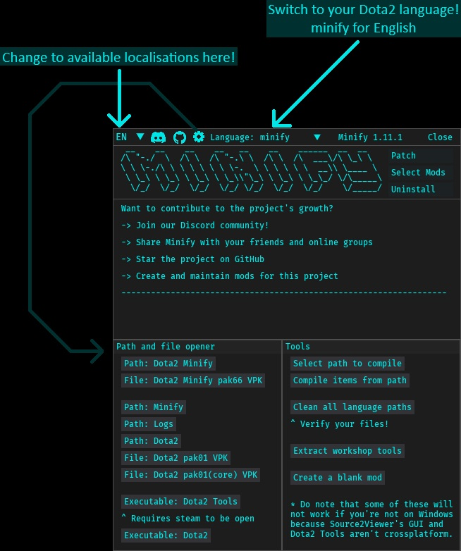
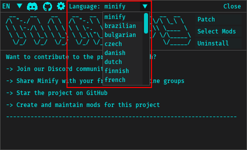
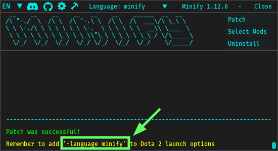
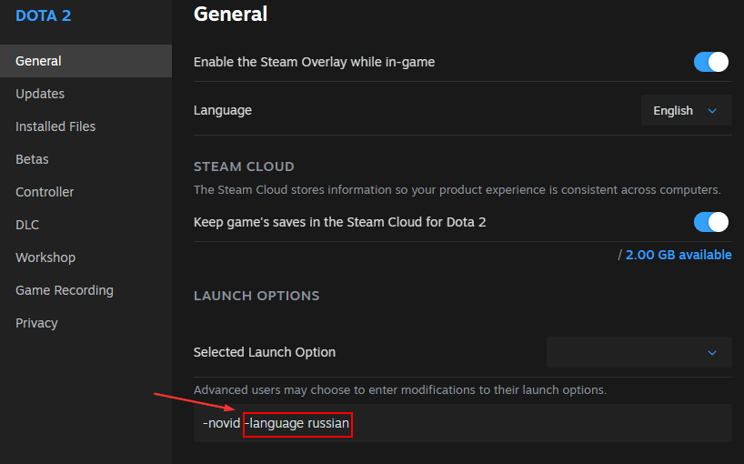
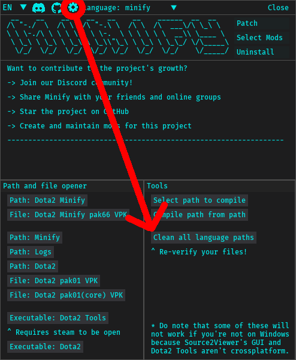

<div align="center">

# Dota2 Minify


[](https://discord.com/invite/2YDnqpbcKM)


**All in one smart patcher for Dota2 to install all types of mods**




</div>

## Table of contents

- [Dota2 Minify](#dota2-minify)
  - [Table of contents](#table-of-contents)
  - [Is this safe to use?](#is-this-safe-to-use)
  - [Installation](#installation)
    - [Community mods](#community-mods)
    - [Optional Setup](#optional-setup)
      - [Using the project locally](#using-the-project-locally)
      - [Compilation from source](#compilation-from-source)
  - [Troubleshooting](#troubleshooting)
    - [Antivirus software flagged it / I don't see an executable](#antivirus-software-flagged-it--i-dont-see-an-executable)
      - [Why though?](#why-though)
      - [How do I trust it?](#how-do-i-trust-it)
    - [VAC dialog](#vac-dialog)
    - [Things are broken!](#things-are-broken)
    - [It doesn't work / open!](#it-doesnt-work--open)
  - [Developing mods](#developing-mods)
    - [Mod files and explanations](#mod-files-and-explanations)
      - [`modcfg.json`](#modcfgjson)
      - [`files` directory](#files-directory)
      - [`blacklist.txt`](#blacklisttxt)
      - [`styling.txt`](#stylingtxt)
      - [`script.py`](#scriptpy)
      - [`xml_mod.json`](#xml_modjson)
      - [`menu.xml`](#menuxml)
    - [Tools of the trade](#tools-of-the-trade)
  - [Thanks](#thanks)
  - [Special thanks to](#special-thanks-to)
  - [Dependencies](#dependencies)
    - [Binaries](#binaries)
    - [Python packages](#python-packages)
  - [License](#license)

## Is this safe to use?

This project has been around for over 4 years with thousands of downloads and users. While binaries are offered for ease of use, anyone can compile it themselves.

The only valid source to get the software is from [GitHub releases](https://github.com/Egezenn/dota2-minify/releases/latest), we do not distribute elsewhere.

No one has ever been banned for these mods. This project strictly deals with VPK modifications and not hacking concepts like memory/file manipulation. It's utilizing Valve's approved methods (VPK loading) for creating assets, as documented on the [official Valve Wiki](https://developer.valvesoftware.com/wiki/VPK). Historically Valve has only disabled assets from loading and never punished modders. The worst thing that can happen is a mod stops working and that's it.

## Installation

1. **Download Minify**

   - [Click here to download the latest Minify release](https://github.com/Egezenn/dota2-minify/releases/latest)

     **(Optional) Install Dota 2 Workshop Tools DLC**

   - These tools enable HUD/Interface mods. **Skip this step if you don't need them.**
   - Right-click on Dota 2 in Steam.
   - Select **Properties** > **DLC**.
     - On Linux, you need to force the use of `Proton Experimental` and have `wine` package installed. Relaunch steam if you still don't see the DLC.
   - Install `Dota 2 Workshop Tools DLC`.

2. **Run Minify**

   - Extract the ZIP file.
   - Ensure that you have execution permissions for the `Minify` executable, run and patch with the mods and the language you want to use.





3. **Setting the language argument for Dota2 on Steam**

   - Right-click on Dota2 in Steam and click **Properties**.
   - **For English:** Add `-language minify` to your launch options.
   - **For Other Languages:** Select the language you want to patch with on the top bar and add `-language language_id`



4. **Start Dota 2**
   - Launch Dota2 and enjoy!

> [!WARNING]
> For people using Minify on Linux with workshop tools!
>
> After patching, extract your workshop tools using the `Gearcog button` > `Extract workshop tools` (this is for later use so that you won't have to switch back and forth again) and go back to using a `Steam Runtime` as you'll not be able to queue games with `Proton Experimental`.

### Community mods

In our [Discord server](https://discord.com/invite/2YDnqpbcKM) we have a forum in which you can find more mods!

### Optional Setup

#### Using the project locally

Prerequisites are `git`, `python` and `uv`. (also `tk` for tkinter and `wine` for workshop tools executables)

- `git clone https://github.com/Egezenn/dota2-minify`
- `cd dota2-minify`
- `uv run Minify`

#### Compilation from source

For instructions, refer to the [workflow](https://github.com/Egezenn/dota2-minify/blob/main/.github/workflows/release.yml).

## Troubleshooting

### Antivirus software flagged it / I don't see an executable

Exclude the folder from your antivirus software(s).

#### Why though?

These are false-positives caused by people generating similiar compilation/hashes for malwares via the same compilers we're using and we don't have a signing certificate to resolve this as the project is relatively small.

#### How do I trust it?

Binaries are released directly from GitHub's build system and there aren't any modifications done from us after releases. If you don't like the executable we're providing, you can run it with Python or build it completely yourself. Instructions for both are included in [the readme](#optional-setup).

### VAC dialog

Verify your files from Steam, this happens every so often randomly and is NOT related to anything the program does.

### Things are broken!

Try uninstalling the mods. If that doesn't work aswell try using the feature below (it'll delete all the contents of `dota 2 beta/game/dota_<language>`!)



### It doesn't work / open!

Make a bug report on GitHub or Discord with the contents of your `logs` folder.

## Developing mods

Minify has a programmatical approach to most modifications to keep everything minimal and simple. If there isn't a method available for your needs, you can always upload your mod files in `mods/<mod_name>/files` to be directly included into the pak minify is going to create or include a python script to accomodate specific behavior.

For most changes, you do not need to reopen the application. Try opening it again if you encounter undesired behavior.

### Mod files and explanations

```plaintext
mods
├── <mod_name>
│   ├── files
│   │   ├── <path_to_file_in_pak>
│   │   ├── <...>
│   │   └── <...>
│   ├── blacklist.txt
│   ├── menu.xml
│   ├── modcfg.json
│   ├── notes_<language>.txt
│   ├── script.py
│   ├── script_after_decompile.py
│   ├── script_after_recompile.py
│   ├── script_uninstall.py
│   ├── styling.txt
│   └── xml_mod.json
```

#### `modcfg.json`

```jsonc
{ // defaults doesn't need to be indicated
  "always": false, // false by default, apply them without checking mods.json or checkbox
  "dependencies": ["<mod>"], // None by default, add a mod dependency's name here 
  "order": 1, // default is 1, ordered from negative to positive to resolve any conflicts
  "visual": true // true by default, show it in the UI as a checkbox
}
```

#### `files` directory

This directory will include any files put here into the pak that minify is going to create. These files should be compiled.

If not specifically protected by Dota2, these files will override any game content. This also applies for the rest of the modification methods available.

#### `blacklist.txt`

This file is a list of path to files used to override those with blanks.
Supported file types can be found in [`bin/blank-files`](Minify/bin/blank-files).

A list of all the files (from the game pak) can be found in [`bin/gamepakcontents.txt`](Minify/bin/gamepakcontents.txt).

Syntax for this file starting from the line beginning is as follows:  
`#`: Comments  
`>>`: Directories  
`**`: RegExp patterns  
`--`: Exclusions (for when you want to exclude specific files from bulk additions)  
`@@`: Links to raw data

After that with no blank spaces you put the path to the file you want to override.
`path/to/file`

```plaintext
particles/base_attacks/ranged_goodguy_launch.vpcf_c
>>particles/sprays
**taunt.*\.vsnd_c
@@link-to-url
```

#### `styling.txt`

This file is a list of CSS paths and styling that will be appended to them.  
By the nature of this method modifications done here may break the original XML or CSS that gets updated resulting in a bad layout.  
In such cases, a repatch or a slight modification is required.

If you encounter errors while patching, it's most likely that your CSS is invalid or the path is wrong. Check [`logs/resourcecompiler.txt`](Minify/logs/resourcecompiler.txt) for more information.

For Source 2 flavored CSS properties, refer to: [Valve Developer Community Wiki](https://developer.valvesoftware.com/wiki/Dota_2_Workshop_Tools/Panorama/CSS_Properties).  
To live inspect the layout, open the workshop tools and press <kbd>F6</kbd> and select the element you'd like to select from the XML.

Syntax for this file starting from the line beginning is as follows:  
`#`: Comments  
`!`: By default, the file is pulled from `dota 2 beta/game/dota/pak01_dir.vpk`.  
However to change this behavior and pull files from `dota 2 beta/game/core/pak01_dir.vpk`, you can use this.  
`@@`: Links to raw data

`path/to/vcss_file_without_extension @@ #example_id { property: value; }`

#### `script.py`

If and when there is a specific behavior to be automated you can include a python script along with your mod. You can find the template below.

Appending `_initial, _after_decompile, _after_recompile, _uninstall` to your script's name will adjust when it'll be executed. Thus giving you the full control of how your mod can be handled. By default it executes while iterating over each mod when you are patching.

```python
# This script template can be run both manually and from minify.
# You are able to use packages and modules from minify (you need an activated environment from the minify root or running with the tool `uv` can automatically handle this.)
import os
import sys

current_dir = os.path.dirname(os.path.abspath(__file__))
minify_root = os.path.abspath(os.path.join(current_dir, os.pardir, os.pardir))
os.chdir(minify_root)

if minify_root not in sys.path:
    sys.path.insert(0, minify_root)

# Any package or module native to minify can be imported here
# import requests
#
# import mpaths
# ...


def main():
    pass
    # Code specific to your mod goes here, minify will try to execute this block.
    # If any exceptions occur, it'll be written to `logs` directory


if __name__ == "__main__":
    main()
```

#### `xml_mod.json`

_to be written_

#### `menu.xml`

_to be written_

### Tools of the trade

_to be written_

## Thanks

This project wouldn't be available without the work of the community. Thanks to everyone that has contributed to the project over GitHub with issues & contributions or Discord!

## Special thanks to


| Mod                                                                                             | Author                                             | Other                                                                                                        |
| ----------------------------------------------------------------------------------------------- | -------------------------------------------------- | ------------------------------------------------------------------------------------------------------------ |
| [`Auto Accept Match`](./Minify/mods/Auto%20Accept%20Match)                                      | [MeGaNeKoS](https://github.com/MeGaNeKoS)          |                                                                                                              |
| [`Auto Language Dialog Accept`](./Minify/mods/#base/files/panorama/scripts/popup_generic.vjs_c) | [MeGaNeKoS](https://github.com/MeGaNeKoS)          |                                                                                                              |
| [`Custom Backgrounds`](./Minify/mods/Custom%20Backgrounds)                                      | [Egezenn](https://github.com/Egezenn)              |                                                                                                              |
| [`Dark Terrain`](./Minify/mods/Dark%20Terrain)                                                  | [robbyz512](https://github.com/robbyz512)          |                                                                                                              |
| [`Minify Base Attacks`](./Minify/mods/Minify%20Base%20Attacks)                                  | [robbyz512](https://github.com/robbyz512)          |                                                                                                              |
| [`Minify Spells & Items`](./Minify/mods/Minify%20Spells%20&%20Items)                            | [robbyz512](https://github.com/robbyz512)          |                                                                                                              |
| [`Misc Optimization`](./Minify/mods/Misc%20Optimization)                                        | [robbyz512](https://github.com/robbyz512)          |                                                                                                              |
| [`Mute Ambient Sounds`](./Minify/mods/Mute%20Ambient%20Sounds)                                  | [robbyz512](https://github.com/robbyz512)          |                                                                                                              |
| [`Mute Announcers`](./Minify/mods/Mute%20Announcers)                                            | [Egezenn](https://github.com/Egezenn)              |                                                                                                              |
| [`Mute Taunt Sounds`](./Minify/mods/Mute%20Taunt%20Sounds)                                      | [robbyz512](https://github.com/robbyz512)          |                                                                                                              |
| [`Mute Voice Line Sounds`](./Minify/mods/Mute%20Voice%20Line%20Sounds)                          | [robbyz512](https://github.com/robbyz512)          |                                                                                                              |
| [`OpenDotaGuides Guides`](./Minify/mods/OpenDotaGuides%20Guides)                                | [Egezenn](https://github.com/Egezenn)              | [Project](https://github.com/Egezenn/OpenDotaGuides)                                                         |
| [`Remove Foilage`](./Minify/mods/Remove%20Foilage)                                              | [robbyz512](https://github.com/robbyz512)          |                                                                                                              |
| [`Revamp Hero Grid Layout`](./Minify/mods/Revamp%20Hero%20Grid%20Layout)                        | [Egezenn](https://github.com/Egezenn)              |                                                                                                              |
| [`Remove Hero Renders`](./Minify/mods/Remove%20Hero%20Renders)                                  | [Egezenn](https://github.com/Egezenn)              |                                                                                                              |
| [`Remove Main Menu Background`](./Minify/mods/Remove%20Main%20Menu%20Background)                | [Egezenn](https://github.com/Egezenn)              |                                                                                                              |
| [`Remove Pings`](./Minify/mods/Remove%20Pings)                                                  | [robbyz512](https://github.com/robbyz512)          |                                                                                                              |
| [`Remove River`](./Minify/mods/Remove%20River)                                                  | [robbyz512](https://github.com/robbyz512)          |                                                                                                              |
| [`Remove Showcases`](./Minify/mods/Remove%20Showcases)                                          | [Egezenn](https://github.com/Egezenn)              |                                                                                                              |
| [`Remove Sprays`](./Minify/mods/Remove%20Sprays)                                                | [robbyz512](https://github.com/robbyz512)          |                                                                                                              |
| [`Remove Weather Effects`](./Minify/mods/Remove%20Weather%20Effects)                            | [robbyz512](https://github.com/robbyz512)          |                                                                                                              |
| [`Repopulate Unit Query HUD`](./Minify/mods/Repopulate%20Unit%20Query%20HUD)                    | [MeGaNeKoS](https://github.com/MeGaNeKoS)          |                                                                                                              |
| [`Reposition & Rescale HUD`](./Minify/mods/Reposition%20&%20Rescale%20HUD/)                     | [robbyz512](https://github.com/robbyz512)          |                                                                                                              |
| [`Revert Ping Sounds`](./Minify/mods/Revert%20Ping%20Sounds)                                    | [Egezenn](https://github.com/Egezenn)              |                                                                                                              |
| [`Show NetWorth`](./Minify/mods/Show%20NetWorth)                                                | [MeGaNeKoS](https://github.com/MeGaNeKoS)          |                                                                                                              |
| [`Stat Site Buttons`](./Minify/mods/Stat%20Site%20Buttons)                                      | [Egezenn](https://github.com/Egezenn)              | Generalized off of `Dotabuff in Profiles` by [yujin sharingan](https://discord.com/users/234341830647480321) |
| [`Transparent HUD`](./Minify/mods/Transparent%20HUD)                                            | [ZerdacK](https://github.com/DotaModdingCommunity) | [Egezenn](https://github.com/Egezenn)                                                                        |
| [`Tree Mod`](./Minify/mods/Tree%20Mod)                                                          | [robbyz512](https://github.com/robbyz512)          |                                                                                                              |
| [`User Styles`](./Minify/mods/User%20Styles)                                                    | [Egezenn](https://github.com/Egezenn)              |                                                                                                              |

## Dependencies

### Binaries

| Name                                                                          | Usage                                                  | License                                                                                                                                                 |
| ----------------------------------------------------------------------------- | ------------------------------------------------------ | ------------------------------------------------------------------------------------------------------------------------------------------------------- |
| [Python](https://www.python.org/)                                             | Core language.                                         | [PSFL license](https://github.com/python/cpython/blob/main/LICENSE)                                                                                     |
| [Source 2 Viewer](https://github.com/ValveResourceFormat/ValveResourceFormat) | Decompilation of contents in paks and listing of them. | [MIT license](https://github.com/ValveResourceFormat/ValveResourceFormat/blob/master/LICENSE)                                                           |
| [ripgrep](https://github.com/BurntSushi/ripgrep)                              | Dynamic blacklist generation.                          | [Unlicense](https://github.com/BurntSushi/ripgrep/blob/master/UNLICENSE) & [MIT license](https://github.com/BurntSushi/ripgrep/blob/master/LICENSE-MIT) |

### Python packages

| Name                                                                   | Usage                                            | License                                                                                                       |
| ---------------------------------------------------------------------- | ------------------------------------------------ | ------------------------------------------------------------------------------------------------------------- |
| [dearpygui](https://github.com/hoffstadt/DearPyGui)                    | GUI                                              | [MIT license](https://github.com/hoffstadt/DearPyGui/blob/master/LICENSE)                                     |
| [json-with-comments](https://github.com/n-takumasa/json-with-comments) | JSON parsing with comments                       | [MIT license](https://github.com/n-takumasa/json-with-comments/blob/main/LICENSE)                             |
| [playsound3](https://github.com/szmikler/playsound3)                   | Playing sounds                                   | [MIT license](https://github.com/szmikler/playsound3/blob/main/LICENSE)                                       |
| [psutil](https://github.com/giampaolo/psutil)                          | Handling processes                               | [BSD-3-Clause license](https://github.com/giampaolo/psutil/blob/master/LICENSE)                               |
| [PyInstaller](https://pyinstaller.org)                                 | Compilation of the binaries                      | [GPLv2 or later + additional properties](https://github.com/pyinstaller/pyinstaller/blob/develop/COPYING.txt) |
| [requests](https://github.com/psf/requests)                            | Downloading/querying project's dependencies      | [Apache-2.0 license](https://github.com/psf/requests/blob/main/LICENSE)                                       |
| [screeninfo](https://github.com/rr-/screeninfo)                        | Calculating initial position for the main window | [MIT license](https://github.com/rr-/screeninfo/blob/master/LICENSE.md)                                       |
| [vdf](https://github.com/ValvePython/vdf)                              | Serializing VDFs                                 | [MIT license](https://github.com/ValvePython/vdf/blob/master/LICENSE)                                         |
| [vpk](https://github.com/ValvePython/vpk)                              | Creating and getting file content list in VPKs   | [MIT license](https://github.com/ValvePython/vpk/blob/master/LICENSE)                                         |

## License

Contents of this repository are licensed under [GPL-3.0](LICENSE), however some files in `Minify/mods/*/files` may contain files that originate from Dota2 itself, with or without modifications to them.
