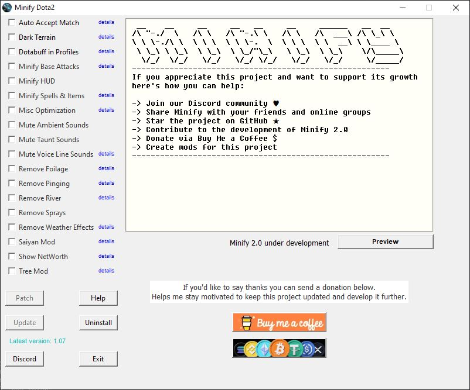

# 
Dota2 Minify

  

 

  
  
  

**
All in one smart patcher for Dota2 to install all types of mods
**

  ✔️500+ Spells Simplified • ✔️8,000+ files modded • ✔️Boost FPS • ✔️ Creator Toolkit

    
    
    
    

## Is this safe to use?

This project has been around for over 3 years with thousands of downloads and users. While binaries are offered for ease of use, anyone can compile it themselves.

No one has ever been banned for these mods. This project strictly deals with VPK modifications and not hacking related things like memory/file manipulation. It is utilizing Valve's approved methods (VPK loading) for creating assets, as documented on the [official Valve Wiki](https://developer.valvesoftware.com/wiki/VPK). Historically Valve has only disabled assets from loading and never punished modders. The worst thing that can happen is a mod stops working and that's it.

## Installation

1. **Download Minify**

   - [Click here to download the latest Minify release](https://github.com/robbyz512/dota2-minify/releases/latest)

    **(Optional) Install Dota 2 Workshop Tools DLC**
    - These tools enable HUD/Interface mods. **Skip this step if you don't need them.**
    - Right-click on Dota 2 in Steam.
    - Select **Properties** > **DLC**.
    - Install **"Dota 2 Workshop Tools DLC"**.

2. **Run Minify**

   - Extract the ZIP file.
   - Run `Minify.exe` and patch with the mods you want to use.

3. **Set Language for Steam**

   - Right-click on Dota2 in Steam and click **Properties**.
   - **For English Dota2:** Add `-language minify` to your launch options. [See example image](https://i.imgur.com/KTfqXUg.jpeg).
   - **For Other Languages:** Follow the [instructions here](https://github.com/robbyz512/dota2-minify/wiki/Minify#using-minify-with-a-different-language-in-dota2).

4. **Start Dota 2**
     - Launch Dota2 and enjoy!

### Optional Setup

**Compile from Source**: If you prefer compiling the project yourself [Click here for instructions](https://github.com/robbyz512/dota2-minify/wiki/Minify#compiling-minify)

**External Binaries**: To get these files from the source `Decompiler.exe` and `libSkiaSharp.dll`:

1. [Click here to go to SteamDatabase/ValveResourceFormat releases](https://github.com/SteamDatabase/ValveResourceFormat/releases/latest)
2. Download `cli-windows-x64.zip`
3. Extract both files into your Minify folder.

## Developing Your Own Mods

You can create your own mods with Minify

[The wiki](https://github.com/robbyz512/dota2-minify/wiki/Dota2-Modding-Tutorials) will teach you the basics of working with steam files and more.

Once you get comfortable with the workflow you can use Minify to easily patch latest files from Dota2 and always have your mods updated.

## Minify File Structure [>> tutorial](https://github.com/robbyz512/dota2-minify/wiki/Minify)

| Name                                                                                  | Description                                                                                   |
|---------------------------------------------------------------------------------------|-----------------------------------------------------------------------------------------------|
| [`Files`](https://github.com/robbyz512/dota2-minify/wiki/Minify#files)                | Compiled files you want to pack (Models, Meshes, Textures...etc)                              |
| [`blacklist.txt`](https://github.com/robbyz512/dota2-minify/wiki/Minify#blacklisttxt) | _Paths_ to files to replace with blanks so they wont appear in game (Particles, Sounds...etc) |
| [`styling.txt`](https://github.com/robbyz512/dota2-minify/wiki/Minify#stylingtxt)     | Custom CSS you want to apply to the Panorama (Interfaces, Layouts, HUD's...etc)               |
| `notes.txt`                                                                           | Optionally include this file to have a details button beside your mod for users to read.      |

## Thanks

This project wouldn't be available without the work of the community. Thanks to everyone that has contributed to the project over [GitHub](https://github.com/robbyz512/dota2-minify/graphs/contributors) or Discord!
