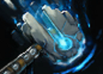
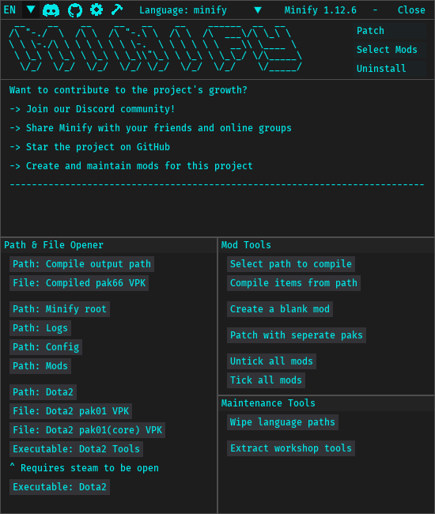

# [Dota2 Minify](https://egezenn.github.io/dota2-minify)

[-000000?style=for-the-badge&logo=apple&logoColor=white)](https://egezenn.github.io/dota2-minify/wiki/#/development?id=running-from-the-source)

## Wiki

The contents of the readme has been moved to [the new wiki](https://egezenn.github.io/dota2-minify/wiki) for better structure and readability.

## Thanks

This project wouldn't be available without the work of the community. Thanks to everyone that has contributed to the project over at GitHub and Discord!

## Special thanks to

| Mod                                                                                             | Author                                             | Other                                                                                                        |
| ----------------------------------------------------------------------------------------------- | -------------------------------------------------- | ------------------------------------------------------------------------------------------------------------ |
| [`Auto Accept Match`](./Minify/mods/Auto%20Accept%20Match)                                      | [MeGaNeKoS](https://github.com/MeGaNeKoS)          |                                                                                                              |
| [`Auto Language Dialog Accept`](./Minify/mods/#base/files/panorama/scripts/popup_generic.vjs_c) | [MeGaNeKoS](https://github.com/MeGaNeKoS)          |                                                                                                              |
| [`Custom Backgrounds`](./Minify/mods/Custom%20Backgrounds)                                      | [Egezenn](https://github.com/Egezenn)              |                                                                                                              |
| [`Custom Fonts`](./Minify/mods/Custom%20Fonts)                                                  | [Egezenn](https://github.com/Egezenn)              |                                                                                                              |
| [`D2PT Hero Grids`](./Minify/mods/D2PT%20Hero%20Grids)                                          | [Egezenn](https://github.com/Egezenn)              | [Dota2ProTracker Meta Hero Grids](https://dota2protracker.com/meta-hero-grids)                               |
| [`Dark Terrain`](./Minify/mods/Dark%20Terrain)                                                  | [robbyz512](https://github.com/robbyz512)          |                                                                                                              |
| [`Minify Base Attacks`](./Minify/mods/Minify%20Base%20Attacks)                                  | [robbyz512](https://github.com/robbyz512)          |                                                                                                              |
| [`Minify Spells & Items`](./Minify/mods/Minify%20Spells%20&%20Items)                            | [robbyz512](https://github.com/robbyz512)          |                                                                                                              |
| [`Misc Optimization`](./Minify/mods/Misc%20Optimization)                                        | [robbyz512](https://github.com/robbyz512)          |                                                                                                              |
| [`Mute Ambient Sounds`](./Minify/mods/Mute%20Ambient%20Sounds)                                  | [robbyz512](https://github.com/robbyz512)          |                                                                                                              |
| [`Mute Default Announcer`](./Minify/mods/Mute%20Default%20Announcer)                            | [Egezenn](https://github.com/Egezenn)              |                                                                                                              |
| [`Mute Taunt Sounds`](./Minify/mods/Mute%20Taunt%20Sounds)                                      | [robbyz512](https://github.com/robbyz512)          |                                                                                                              |
| [`Mute Voice Line Sounds`](./Minify/mods/Mute%20Voice%20Line%20Sounds)                          | [robbyz512](https://github.com/robbyz512)          |                                                                                                              |
| [`OpenDotaGuides Guides`](./Minify/mods/OpenDotaGuides%20Guides)                                | [Egezenn](https://github.com/Egezenn)              | [Project](https://github.com/Egezenn/OpenDotaGuides)                                                         |
| [`Remove Foilage`](./Minify/mods/Remove%20Foilage)                                              | [robbyz512](https://github.com/robbyz512)          |                                                                                                              |
| [`Revamp Hero Grid Layout`](./Minify/mods/Revamp%20Hero%20Grid%20Layout)                        | [Egezenn](https://github.com/Egezenn)              |                                                                                                              |
| [`Remove Hero Renders`](./Minify/mods/Remove%20Hero%20Renders)                                  | [Egezenn](https://github.com/Egezenn)              |                                                                                                              |
| [`Remove Main Menu Background`](./Minify/mods/Remove%20Main%20Menu%20Background)                | [Egezenn](https://github.com/Egezenn)              |                                                                                                              |
| [`Remove Pings`](./Minify/mods/Remove%20Pings)                                                  | [robbyz512](https://github.com/robbyz512)          |                                                                                                              |
| [`Remove River`](./Minify/mods/Remove%20River)                                                  | [robbyz512](https://github.com/robbyz512)          |                                                                                                              |
| [`Remove Showcases`](./Minify/mods/Remove%20Showcases)                                          | [Egezenn](https://github.com/Egezenn)              |                                                                                                              |
| [`Remove Sprays`](./Minify/mods/Remove%20Sprays)                                                | [robbyz512](https://github.com/robbyz512)          |                                                                                                              |
| [`Remove Weather Effects`](./Minify/mods/Remove%20Weather%20Effects)                            | [robbyz512](https://github.com/robbyz512)          |                                                                                                              |
| [`Repopulate Unit Query HUD`](./Minify/mods/Repopulate%20Unit%20Query%20HUD)                    | [MeGaNeKoS](https://github.com/MeGaNeKoS)          |                                                                                                              |
| [`Reposition & Rescale HUD`](./Minify/mods/Reposition%20&%20Rescale%20HUD)                      | [robbyz512](https://github.com/robbyz512)          |                                                                                                              |
| [`Revert Ping Sounds`](./Minify/mods/Revert%20Ping%20Sounds)                                    | [Egezenn](https://github.com/Egezenn)              |                                                                                                              |
| [`Show NetWorth`](./Minify/mods/Show%20NetWorth)                                                | [MeGaNeKoS](https://github.com/MeGaNeKoS)          |                                                                                                              |
| [`Stat Site Buttons`](./Minify/mods/Stat%20Site%20Buttons)                                      | [Egezenn](https://github.com/Egezenn)              | Generalized off of `Dotabuff in Profiles` by [yujin sharingan](https://discord.com/users/234341830647480321) |
| [`Transparent HUD`](./Minify/mods/Transparent%20HUD)                                            | [ZerdacK](https://github.com/DotaModdingCommunity) | [Egezenn](https://github.com/Egezenn)                                                                        |
| [`Tree Mod`](./Minify/mods/Tree%20Mod)                                                          | [robbyz512](https://github.com/robbyz512)          |                                                                                                              |
| [`User Styles`](./Minify/mods/User%20Styles)                                                    | [Egezenn](https://github.com/Egezenn)              |                                                                                                              |

## Dependencies

### Binaries

| Name                                                                          | Usage                                 | License                                                                                                                                                 |
| ----------------------------------------------------------------------------- | ------------------------------------- | ------------------------------------------------------------------------------------------------------------------------------------------------------- |
| [Python](https://www.python.org)                                              | Core language                         | [PSFL license](https://github.com/python/cpython/blob/main/LICENSE)                                                                                     |
| [ripgrep](https://github.com/BurntSushi/ripgrep)                              | RegExp patterns                       | [Unlicense](https://github.com/BurntSushi/ripgrep/blob/master/UNLICENSE) & [MIT license](https://github.com/BurntSushi/ripgrep/blob/master/LICENSE-MIT) |
| [Source 2 Viewer](https://github.com/ValveResourceFormat/ValveResourceFormat) | VPK interaction & asset decompilation | [MIT license](https://github.com/ValveResourceFormat/ValveResourceFormat/blob/master/LICENSE)                                                           |

### Python packages

| Name                                                                   | Usage                                     | License                                                                                                       |
| ---------------------------------------------------------------------- | ----------------------------------------- | ------------------------------------------------------------------------------------------------------------- |
| [dearpygui](https://github.com/hoffstadt/DearPyGui)                    | GUI                                       | [MIT license](https://github.com/hoffstadt/DearPyGui/blob/master/LICENSE)                                     |
| [json-with-comments](https://github.com/n-takumasa/json-with-comments) | JSON parsing with comments                | [MIT license](https://github.com/n-takumasa/json-with-comments/blob/main/LICENSE)                             |
| [playsound3](https://github.com/szmikler/playsound3)                   | Playing sounds                            | [MIT license](https://github.com/szmikler/playsound3/blob/main/LICENSE)                                       |
| [psutil](https://github.com/giampaolo/psutil)                          | Checking Dota2 processes existence        | [BSD-3-Clause license](https://github.com/giampaolo/psutil/blob/master/LICENSE)                               |
| [PyInstaller](https://pyinstaller.org)                                 | Compilation                               | [GPLv2 or later + additional properties](https://github.com/pyinstaller/pyinstaller/blob/develop/COPYING.txt) |
| [requests](https://github.com/psf/requests)                            | Downloading/querying project dependencies | [Apache-2.0 license](https://github.com/psf/requests/blob/main/LICENSE)                                       |
| [screeninfo](https://github.com/rr-/screeninfo)                        | Position calculation                      | [MIT license](https://github.com/rr-/screeninfo/blob/master/LICENSE.md)                                       |
| [vdf](https://github.com/ValvePython/vdf)                              | Serializing VDFs                          | [MIT license](https://github.com/ValvePython/vdf/blob/master/LICENSE)                                         |
| [vpk](https://github.com/ValvePython/vpk)                              | VPK interaction                           | [MIT license](https://github.com/ValvePython/vpk/blob/master/LICENSE)                                         |

## License

Contents of this repository are licensed under [GPL-3.0](LICENSE), however some files in `Minify/mods/*/files` may contain assets that originate from Dota2 itself, with or without modifications to them.
