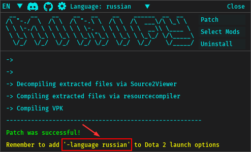

# <div align="center">Dota2 Minify</div>

<div align="center">
  
</div>

<br>

<div align="center">

[](https://discord.com/invite/2YDnqpbcKM)
[](https://github.com/Egezenn/dota2-minify/wiki)


</div>

<h3 align="center">All in one smart patcher for Dota2 to install all types of mods</h3>

<h3 align="center">Updated to 7.39!</h3>

<div align="center">
    <a href="#"></a>
    <a href="#"></a>
</div>

## Table of contents

- [Dota2 Minify](#dota2-minify)
  - [Table of contents](#table-of-contents)
  - [Is this safe to use?](#is-this-safe-to-use)
  - [Installation](#installation)
    - [Community mods](#community-mods)
    - [Optional Setup](#optional-setup)
      - [Using the project locally](#using-the-project-locally)
      - [Compilation from source](#compilation-from-source)
  - [Developing mods](#developing-mods)
    - [Mod files and explanations](#mod-files-and-explanations)
      - [`files` directory](#files-directory)
      - [`blacklist.txt`](#blacklisttxt)
      - [`styling.txt`](#stylingtxt)
      - [`script.py`](#scriptpy)
      - [`xml_mod.json`](#xml_modjson)
      - [`menu.xml`](#menuxml)
    - [Tools of the trade](#tools-of-the-trade)
  - [Thanks](#thanks)
  - [Special thanks to](#special-thanks-to)
    - [robbyz512](#robbyz512)
    - [Egezenn](#egezenn)
    - [ZerdacK](#zerdack)
    - [MeGaNeKoS](#meganekos)
    - [sadesguy](#sadesguy)
    - [yujin sharingan](#yujin-sharingan)
    - [otf31](#otf31)
  - [Dependencies](#dependencies)
    - [Binaries](#binaries)
    - [Python packages](#python-packages)
  - [License](#license)

## Is this safe to use?

This project has been around for over 4 years with thousands of downloads and users. While binaries are offered for ease of use, anyone can compile it themselves.

No one has ever been banned for these mods. This project strictly deals with VPK modifications and not hacking concepts like memory/file manipulation. It's utilizing Valve's approved methods (VPK loading) for creating assets, as documented on the [official Valve Wiki](https://developer.valvesoftware.com/wiki/VPK). Historically Valve has only disabled assets from loading and never punished modders. The worst thing that can happen is a mod stops working and that's it.

## Installation

1. **Download Minify**

   - [Click here to download the latest Minify release](https://github.com/Egezenn/dota2-minify/releases/latest)

     **(Optional) Install Dota 2 Workshop Tools DLC**

   - These tools enable HUD/Interface mods. **Skip this step if you don't need them.**
   - Right-click on Dota 2 in Steam.
   - Select **Properties** > **DLC**.
     - On Linux, you need to force the use of `Proton Experimental` and have `wine` package installed. Relaunch steam if you still don't see the DLC.
   - Install `Dota 2 Workshop Tools DLC`.

2. **Run Minify**

   - Extract the ZIP file.
   - Run `Minify` executable and patch with the mods and the language you want to use.

     <a href="#"></a>
     <a href="#"></a>

3. **Setting the language argument for Dota2 on Steam**

   - Right-click on Dota2 in Steam and click **Properties**.
   - **For English:** Add `-language minify` to your launch options.
   - **For Other Languages:** Select the language you want to patch with on the top bar and add `-language language_id`
     <a href="#"></a>

4. **Start Dota 2**
   - Launch Dota2 and enjoy!

> [!WARNING]
> For people using Minify on Linux with workshop tools!
>
> After patching, extract your workshop tools using the `Gearcog button` > `Extract workshop tools` (this is for later use so that you won't have to switch back and forth again) and go back to using a `Steam Runtime` as you'll not be able to queue games with `Proton Experimental`.

### Community mods

In our [Discord server](https://discord.com/invite/2YDnqpbcKM) we have a forum in which you can find more mods!

### Optional Setup

#### Using the project locally

Prerequisites are `git`, `python` and `uv`. (also `tk` for tkinter and `wine` for workshop tools executables)

- `git clone https://github.com/Egezenn/dota2-minify`
- `cd dota2-minify`
- `uv run Minify`

#### Compilation from source

For instructions, refer to the [workflow](https://github.com/Egezenn/dota2-minify/blob/main/.github/workflows/release.yml).

## Developing mods

Minify has a programmatical approach to most modifications to keep everything minimal and simple. If there isn't a method available for your needs, you can always upload your mod files in `mods/<mod_name>/files` to be directly included into the pak minify is going to create or include a python script to accomodate specific behavior.

### Mod files and explanations

```plaintext
mods
├── <mod_name>
│   ├── files
│   │   ├── <path_to_file_in_pak>
│   │   ├── <...>
│   │   └── <...>
│   ├── blacklist.txt
│   ├── menu.xml
│   ├── modcfg.json
│   ├── notes_<language>.txt
│   ├── script.py
│   ├── script_after_decompile.py
│   ├── script_after_recompile.py
│   ├── script_uninstall.py
│   ├── styling.txt
│   └── xml_mod.json
```

> [!WARNING]
> It's not required to have all these files and directories
>
> With the version 1.12 you aren't required to keep blank files in your mod's contents anymore. Only include the files needed and delete the rest.

#### `modcfg.json`

```json
{
  "order": 1, // default is 1, ordered from negative to positive to resolve any conflicts
  "visual": true, // true by default, show it in the UI as a checkbox
  "always": false // false by default, apply them without checking mods.json or checkbox
}
```

#### `files` directory

This directory will include any files put here into the pak that minify is going to create. These files should be compiled.

If not specifically protected by Dota2, these files will override any game content. This also applies for the rest of the modification methods available.

#### `blacklist.txt`

This file is a list of path to files used to override those with blanks.
Supported file types can be found in [`bin/blank-files`](Minify/bin/blank-files).

A list of all the files (from the game pak) can be found in [`bin/gamepakcontents.txt`](Minify/bin/gamepakcontents.txt).

Syntax for this file starting from the line beginning is as follows:  
`#`: Comments  
`>>`: Directories  
`**`: RegExp patterns  
`--`: Exclusions (for when you want to exclude specific files from bulk additions)  
`@@`: Links to raw data

After that with no blank spaces you put the path to the file you want to override.
`path/to/file`

```plaintext
particles/base_attacks/ranged_goodguy_launch.vpcf_c
>>particles/sprays
**taunt.*\.vsnd_c
@@link-to-url
```

#### `styling.txt`

This file is a list of CSS paths and styling that will be appended to them.  
By the nature of this method modifications done here may break the original XML or CSS that gets updated resulting in a bad layout.  
In such cases, a repatch is required.

If you encounter errors while patching, it's most likely that your CSS is invalid or the path is wrong.

For Source 2 flavored CSS properties, refer to: [Valve Developer Community Wiki](https://developer.valvesoftware.com/wiki/Dota_2_Workshop_Tools/Panorama/CSS_Properties).  
To live inspect the layout, open the workshop tools and press <kbd>F6</kbd> and select the element you'd like to select from the XML.

Syntax for this file starting from the line beginning is as follows:  
`#`: Comments  
`!`: By default, the file is pulled from `dota 2 beta/game/dota/pak01_dir.vpk`.  
However to change this behavior and pull files from `dota 2 beta/game/core/pak01_dir.vpk`, you can use this.  
`@@`: Links to raw data

`path/to/vcss_file_without_extension @@ #example_id { property: value; }`

#### `script.py`

If and when there is a specific behavior to be automated you can include a python script along with your mod. You can find the template below.

Appending `_initial, _after_decompile, _after_recompile, _uninstall` to your script's name will adjust when it'll be executed. Thus giving you the full control of how your mod can be handled. By default it executes while iterating over each mod when you are patching.

```python
# This script template can be run both manually and from minify.
# You are able to use packages and modules from minify (you need an activated environment from the minify root or running with the tool `uv` can automatically handle this.)
import os
import sys

current_dir = os.path.dirname(os.path.abspath(__file__))
minify_root = os.path.abspath(os.path.join(current_dir, os.pardir, os.pardir))
if minify_root not in sys.path:
    sys.path.insert(0, minify_root)

# Any package or module native to minify can be imported here
# import requests
#
# import mpaths
# ...


def main():
    pass
    # Code specific to your mod goes here, minify will try to execute this block.
    # If any exceptions occur, it'll be written to `logs` directory


if __name__ == "__main__":
    main()
```

#### `xml_mod.json`

_to be written_

#### `menu.xml`

_to be written_

### Tools of the trade

_to be written_

## Thanks

This project wouldn't be available without the work of the community. Thanks to everyone that has contributed to the project over [GitHub](https://github.com/Egezenn/dota2-minify/graphs/contributors) or [Discord](https://discord.com/invite/2YDnqpbcKM)!

## Special thanks to

### [robbyz512](https://github.com/robbyz512)

Creation of the base project.

<details>
<summary>Mods</summary>

- [`Dark Terrain`](./Minify/mods/Dark%20Terrain)
- [`Minify Base Attacks`](./Minify/mods/Minify%20Base%20Attacks)
- [`Reposition & Rescale HUD`](./Minify/mods/Reposition%20&%20Rescale%20HUD/)
- [`Minify Spells & Items`](./Minify/mods/Minify%20Spells%20&%20Items)
- [`Misc Optimization`](./Minify/mods/Misc%20Optimization)
- [`Mute Ambient Sounds`](./Minify/mods/Mute%20Ambient%20Sounds)
- [`Mute Taunt Sounds`](./Minify/mods/Mute%20Taunt%20Sounds)
- [`Mute Voice Line Sounds`](./Minify/mods/Mute%20Voice%20Line%20Sounds)
- [`Remove Foilage`](./Minify/mods/Remove%20Foilage)
- [`Remove Pings`](./Minify/mods/Remove%20Pings)
- [`Remove River`](./Minify/mods/Remove%20River)
- [`Remove Sprays`](./Minify/mods/Remove%20Sprays)
- [`Remove Weather Effects`](./Minify/mods/Remove%20Weather%20Effects)
- [`Tree Mod`](./Minify/mods/Tree%20Mod)

</details>

### [Egezenn](https://github.com/Egezenn)

Taking over the maintainership of the project, implementing automated workflows, various improvements, full Linux port, RegExp blacklists, scripting support, Turkish translations and [more](https://github.com/Egezenn/dota2-minify/commits/main/?author=Egezenn).

<details>
<summary>Mods</summary>

- [`Custom Backgrounds`](./Minify/mods/Custom%20Backgrounds)
- [`Mute Announcers`](./Minify/mods/Mute%20Announcers)
- [`OpenDotaGuides Guides`](./Minify/mods/OpenDotaGuides%20Guides) - [Project](https://github.com/Egezenn/OpenDotaGuides)
- [`Remove Hero Card Clutter`](./Minify/mods/Remove%20Hero%20Card%20Clutter)
- [`Remove Hero Renders`](./Minify/mods/Remove%20Hero%20Renders)
- [`Remove Main Menu Background`](./Minify/mods/Remove%20Main%20Menu%20Background)
- [`Remove Showcases`](./Minify/mods/Remove%20Showcases)
- [`Revert Ping Sounds`](./Minify/mods/Revert%20Ping%20Sounds)
- [`Stat Site Buttons`](./Minify/mods/Stat%20Site%20Buttons)
- [`Transparent HUD`](./Minify/mods/Transparent%20HUD/) improvements
- Snippets in [`User Styles`](./Minify/mods/User%20Styles)

</details>

### [ZerdacK](https://github.com/DotaModdingCommunity)

Rewrite of the GUI, Russian translations, mod fixes and [more](https://github.com/Egezenn/dota2-minify/commits/main/?author=DotaModdingCommunity).

<details>
<summary>Mods</summary>

- [`Transparent HUD`](./Minify/mods/Transparent%20HUD)

</details>

### [MeGaNeKoS](https://github.com/MeGaNeKoS)

XML mod behavior and Minify mod settings section.

<details>
<summary>Mods</summary>

- [`Auto Accept Match`](./Minify/mods/Auto%20Accept%20Match)
- [`Auto Language Dialog Accept`](./Minify/mods/base/files/panorama/scripts/popup_generic.vjs_c)
- [`Repopulate Unit Query HUD`](./Minify/mods/Repopulate%20Unit%20Query%20HUD)
- [`Show NetWorth`](./Minify/mods/Show%20NetWorth)

</details>

### [sadesguy](https://github.com/sadesguy)

MacOS port and workflow.

### [yujin sharingan](https://discord.com/users/234341830647480321)

<details>
<summary>Mods</summary>

- `Dotabuff in Profiles` mod which has been refactored to [`Stat Site Buttons`](./Minify/mods/Stat%20Site%20Buttons)

</details>

### [otf31](https://github.com/otf31)

Spanish translation.

## Dependencies

### Binaries

[Python](https://www.python.org/) - Core language. Licensed under PSFL license.

[Source 2 Viewer](https://github.com/ValveResourceFormat/ValveResourceFormat) - Used in decompilation of contents in paks and listing of them. Licensed under MIT license.

[ripgrep](https://github.com/BurntSushi/ripgrep) - Used in dynamic blacklist generation. Licensed under Unlicense and MIT licenses.

### Python packages

| Name                                                 | Usage                                            | License                                                                                                       |
| ---------------------------------------------------- | :----------------------------------------------- | ------------------------------------------------------------------------------------------------------------- |
| [dearpygui](https://github.com/hoffstadt/DearPyGui)  | GUI                                              | [MIT license](https://github.com/hoffstadt/DearPyGui/blob/master/LICENSE)                                     |
| [playsound3](https://github.com/szmikler/playsound3) | Playing sounds                                   | [MIT license](https://github.com/szmikler/playsound3/blob/main/LICENSE)                                       |
| [psutil](https://github.com/giampaolo/psutil)        | Handling processes                               | [BSD-3-Clause license](https://github.com/giampaolo/psutil/blob/master/LICENSE)                               |
| [PyInstaller](https://pyinstaller.org)               | Compilation of the binaries                      | [GPLv2 or later + additional properties](https://github.com/pyinstaller/pyinstaller/blob/develop/COPYING.txt) |
| [requests](https://github.com/psf/requests)          | Downloading/querying project's dependencies      | [Apache-2.0 license](https://github.com/psf/requests/blob/main/LICENSE)                                       |
| [screeninfo](https://github.com/rr-/screeninfo)      | Calculating initial position for the main window | [MIT license](https://github.com/rr-/screeninfo/blob/master/LICENSE.md)                                       |
| [vdf](https://github.com/ValvePython/vdf)            | Serializing VDFs                                 | [MIT license](https://github.com/ValvePython/vdf/blob/master/LICENSE)                                         |
| [vpk](https://github.com/ValvePython/vpk)            | Creating and getting file content list in VPKs   | [MIT license](https://github.com/ValvePython/vpk/blob/master/LICENSE)                                         |

## License

Contents of this repository are licensed under [GPL-3.0](LICENSE), however some files in `Minify/mods/*/files` may contain files that originate from Dota2 itself, with or without modifications to them.
